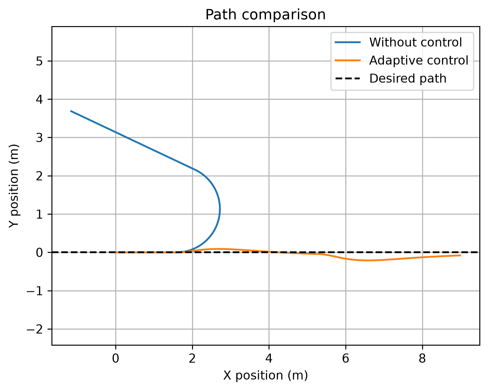

# Adaptive Slip Compensation for a Skid-Steer Mobile Robot
A simulation-based machine learning project for detecting wheel slip and compensating for path deviation in a skid-steer mobile robot.

## Project Overview

This project simulates a four-wheel skid-steer mobile robot driven by two motors: one motor for the left wheels and one for the right wheels.

A neural network estimates the slip of each side using motor commands, motor speeds, linear velocity, and angular velocity. An adaptive controller then adjusts the motor commands and uses position and heading feedback to return the robot toward the desired path.

The project is inspired by the adaptive-control concept presented in Neural-Fly, but applies the idea to a simplified ground vehicle using synthetic data.

The dataset used in this project is synthetically generated from a simplified mathematical model of motor dynamics, wheel grip, and slip. Therefore, the current results demonstrate the proposed method in simulation and have not yet been validated on a physical robot.

## Main Features

- Skid-steer vehicle kinematic simulation
- First-order motor dynamics
- Synthetic wheel-slip data generation
- Neural-network slip estimation using PyTorch
- Adaptive motor-command compensation
- Position and heading feedback control
- Comparison of controlled and uncontrolled trajectories
- Numerical evaluation using maximum and final lateral errors

## Project Structure

```text
adaptive-slip-car/
├── data/
│   └── slip_data.csv
├── models/
│   └── slip_predictor.pth
├── results/
│   └── path_comparison.png
├── src/
│   ├── motor.py
│   ├── vehicle.py
│   ├── simulate_basic.py
│   ├── test_motor.py
│   ├── compare_slip.py
│   ├── generate_data.py
│   ├── analyze_data.py
│   ├── train_model.py
│   ├── predict_slip.py
│   └── compare_control.py
├── .gitignore
├── requirements.txt
└── README.md
```

## Mathematical Model

The linear and angular velocities of the skid-steer robot are calculated as:

$$
v = \frac{v_R + v_L}{2}
$$

$$
\omega = \frac{v_R - v_L}{L}
$$

where $v_L$ and $v_R$ are the left and right wheel velocities, and $L$ is the track width.

The robot pose is updated using:

$$
x_{k+1} = x_k + v\cos(\theta)\Delta t
$$

$$
y_{k+1} = y_k + v\sin(\theta)\Delta t
$$

$$
\theta_{k+1} = \theta_k + \omega\Delta t
$$

Motor response is represented by a first-order model:

$$
v_{\text{motor,new}} =
v_{\text{motor,old}} +
\frac{v_{\text{target}}-v_{\text{motor,old}}}{\tau}\Delta t
$$

Wheel slip reduces the effective velocity:

$$
v_{\text{effective}} = (1-s)v_{\text{motor}}
$$

## Machine Learning Model

The neural network receives six observable inputs:

1. Left motor command
2. Right motor command
3. Left motor speed
4. Right motor speed
5. Measured linear velocity
6. Measured angular velocity

It predicts two outputs: left-wheel slip and right-wheel slip.

The network contains two hidden layers with 16 neurons and ReLU activation functions:

6 inputs → 16 neurons → ReLU → 16 neurons → ReLU → 2 outputs

The synthetic dataset contains 2,000 samples and is divided into 80% training data and 20% test data. The model is trained using mean squared error (MSE) loss and the Adam optimizer.

The trained model achieved:

- Test MSE: 0.000148
- Test MAE: 0.00850

## Adaptive Controller

The controller combines learned slip compensation with position and heading feedback.

The desired angular velocity is calculated from lateral-position and heading errors:

$$
\omega_{\text{desired}} = k_y e_y + k_\theta e_\theta
$$

The desired left and right velocities are:

$$
v_{L,\text{desired}} =
v_{\text{desired}} -
\frac{\omega_{\text{desired}}L}{2}
$$

$$
v_{R,\text{desired}} =
v_{\text{desired}} +
\frac{\omega_{\text{desired}}L}{2}
$$

The motor commands are compensated using the predicted slip:

$$
u_{\text{corrected}} =
\frac{v_{\text{desired}}}{1-\hat{s}}
$$

The commands are limited to the valid range from 0 to 1.

## Results

A slip ratio of 0.3 is applied to the left side between simulation steps 30 and 89. The uncontrolled robot permanently changes its heading, while the adaptive controller limits the deviation and guides the robot back toward the desired path.



| Metric | Without Control | Adaptive Control |
|---|---:|---:|
| Maximum lateral error | 3.686 m | 0.211 m |
| Final lateral error | 3.686 m | 0.080 m |

The adaptive controller reduced the maximum lateral error by approximately 94.3% and the final lateral error by approximately 97.8%.

## Installation

Python 3.11 or a compatible version is recommended.

Run the following commands from the project root directory:

1. Create a virtual environment: `python -m venv .venv`
2. Activate it in Windows PowerShell: `.\.venv\Scripts\Activate.ps1`
3. Install the dependencies: `pip install -r requirements.txt`

## Usage

Generate the synthetic dataset:

`python src/generate_data.py`

Train and evaluate the neural network:

`python src/train_model.py`

Test a single slip prediction:

`python src/predict_slip.py`

Compare the controlled and uncontrolled trajectories:

`python src/compare_control.py`

## Limitations and Future Work

- The dataset is synthetic and based on simplified assumptions.
- Linear and angular velocities are treated as available measurements.
- The model has not been validated on a physical robot.
- Future work can include sensor noise, changing road conditions, real sensor data, and hardware experiments.

## Inspiration

This project is conceptually inspired by the adaptive learning and control approach used in the Neural-Fly project:

https://github.com/aerorobotics/neural-fly

This repository is an independent simplified implementation for a skid-steer ground robot and is not a reproduction of Neural-Fly.
